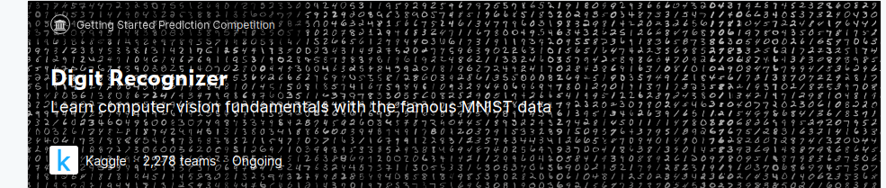
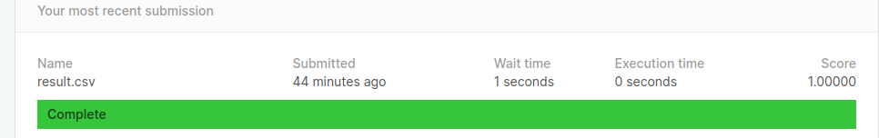

# kaggle-handwriting-digits-100-percent

## Introduction



Handwriting digits recognizing is a good getting-started competition for the beginner of CNN.<br>
However, many competitors get 100% accuracy in this competition, which is impossible for many situations in the reality.<br>


## How

How did they get that? Actually, It's the **overfitting** problems.<br>
The only way to do that is to **download the whole minst data set,** and match every sample with the origin data.<br>
This repo is going to make that with **KNN** algorithm(**let k = 1**).

The result is shown below:




## Build

There is no need for you to rerun this script.<br>

The result is already **saved in the "result.csv" file**.<br>

If you really want to run this script for some other reasons, you can do as follows:<br>

We recommend using python3 and a virtual env. See instructions [here](https://cs230-stanford.github.io/project-starter-code.html).

```bash
virtualenv -p python3 .env
source .env/bin/activate
pip install -r requirements.txt
```

When you're done working on the project, deactivate the virtual environment with `deactivate`.

Then, execute the following command:

```bash
python main.py
```

And you will get the "result.csv" in your working directory.


## Warning

This repo is only for figuring out how to get 100% percent accuracy in kaggle handwriting digits recognizing competition.<br>
The method I used isn't for the actual project. It's incorrect. When you are doing other platforms' competitions and other projects that will apply in the reality, avoiding using that.<br> 


